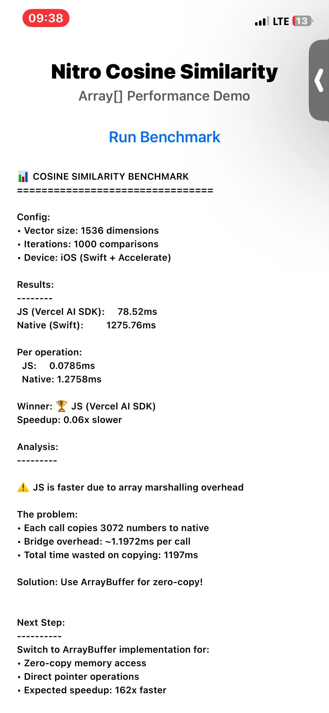

# React Native Nitro Cosine Similarity

A performance comparison of cosine similarity implementations in React Native, comparing pure JavaScript (Vercel AI SDK) against native Swift implementations using Nitro Modules.

**Author**: [@DaveyEke](https://twitter.com/1804davey)  
**Built with**: [Nitro Modules](https://github.com/mrousavy/nitro) by [@mrousavy](https://twitter.com/mrousavy)

## Overview

This project explores different approaches to implementing cosine similarity in React Native, with a focus on performance optimization through native code and zero-copy memory access.


*Native implementation with ArrayBuffer (zero-copy) - Fastest performance*


*Native implementation with regular arrays - Shows marshalling overhead*


### NOTE

The test was done with a base iPhone 12 running iOS 26.1

Link to Vercel AI SDK [cosineSimilarity package](tab:https://github.com/vercel/ai/blob/main/packages/ai/src/util/cosine-similarity.ts)

## Implementation Journey

### 1. Initial Scalar Implementation (Array with Double)

The first implementation used a simple scalar loop in Swift, accepting regular arrays:

**Swift Implementation:**
```swift
import Foundation
import NitroModules

enum CosineSimilarityError: Error {
    case vectorLengthMismatch
}

class HybridCosineSimilarity: HybridCosineSimilaritySpec {
    func cosineSimilarity(vectorA: [Double], vectorB: [Double]) throws -> Double {
        guard vectorA.count == vectorB.count else {
            throw CosineSimilarityError.vectorLengthMismatch
        }
        
        let n = vectorA.count
        
        if n == 0 {
            return 0.0
        }
        
        var magnitudeSquared1: Double = 0.0
        var magnitudeSquared2: Double = 0.0
        var dotProduct: Double = 0.0
        
        for i in 0..<n {
            let value1 = vectorA[i]
            let value2 = vectorB[i]
            
            magnitudeSquared1 += value1 * value1
            magnitudeSquared2 += value2 * value2
            dotProduct += value1 * value2
        }
        
        guard magnitudeSquared1 != 0 && magnitudeSquared2 != 0 else {
            return 0.0
        }
        
        return dotProduct / (sqrt(magnitudeSquared1) * sqrt(magnitudeSquared2))
    }
}
```

**TypeScript Spec:**
```typescript
import type { HybridObject } from 'react-native-nitro-modules'

export interface CosineSimilarity extends HybridObject<{ ios: 'swift', android: 'kotlin' }> {
  cosineSimilarity(vectorA: number[], vectorB: number[]): number
}
```

**Benchmark Code:**
```typescript
const vectorSize = 1536;
const iterations = 1000;

const vectorPairs = Array.from({ length: iterations }, () => ({
  v1: Array.from({ length: vectorSize }, () => Math.random()),
  v2: Array.from({ length: vectorSize }, () => Math.random())
}));

// Test Native
const nativeStart = performance.now();
for (let i = 0; i < iterations; i++) {
  NitroCosSim.cosineSimilarity(vectorPairs[i].v1, vectorPairs[i].v2);
}
const nativeTime = performance.now() - nativeStart;

// Test JS
const jsStart = performance.now();
for (let i = 0; i < iterations; i++) {
  cosineSimilarity(vectorPairs[i].v1, vectorPairs[i].v2);
}
const jsTime = performance.now() - jsStart;
```

**Results**: JavaScript was faster due to array marshalling overhead and lack of SIMD optimization.

### 2. Accelerate Framework with Arrays (vDSP)

The second implementation leveraged Apple's Accelerate framework with vDSP (Vector DSP) operations:

**Swift Implementation:**
```swift
import Foundation
import Accelerate
import NitroModules

enum CosineSimilarityError: Error {
    case vectorLengthMismatch
}

class HybridCosineSimilarity: HybridCosineSimilaritySpec {
    func cosineSimilarity(vectorA: [Double], vectorB: [Double]) throws -> Double {
        guard vectorA.count == vectorB.count else {
            throw CosineSimilarityError.vectorLengthMismatch
        }
        
        let n = vDSP_Length(vectorA.count)
        
        guard n > 0 else {
            return 0.0
        }
        
        var dotProduct: Double = 0
        var magA: Double = 0
        var magB: Double = 0
        
        // vDSP SIMD operations
        vDSP_dotprD(vectorA, 1, vectorB, 1, &dotProduct, n)
        vDSP_svesqD(vectorA, 1, &magA, n)
        vDSP_svesqD(vectorB, 1, &magB, n)
        
        let denom = sqrt(magA) * sqrt(magB)
        
        return denom == 0 ? 0 : dotProduct / denom
    }
}
```

**TypeScript Spec:** (same as above)

**Benchmark Code:** (same as above)

**Results**: Native with vDSP was slower than the scalar implementation.

### 3. Accelerate Framework with ArrayBuffer (Zero-Copy)

The final implementation uses ArrayBuffer for zero-copy memory access:

**Swift Implementation:**
```swift
import Foundation
import Accelerate
import NitroModules

enum CosineSimilarityError: Error {
    case vectorLengthMismatch
}

class HybridCosineSimilarity: HybridCosineSimilaritySpec {
    func cosineSimilarity(vectorA: NitroModules.ArrayBuffer, vectorB: NitroModules.ArrayBuffer) throws -> Double {
        let dataA = vectorA.data
        let dataB = vectorB.data
        
        let sizeA = vectorA.size
        let sizeB = vectorB.size
        
        let countA = sizeA / MemoryLayout<Double>.stride
        let countB = sizeB / MemoryLayout<Double>.stride
        
        guard countA == countB else {
            throw CosineSimilarityError.vectorLengthMismatch
        }
        
        let n = vDSP_Length(countA)
        
        guard n > 0 else {
            return 0.0
        }
        
        // Cast to Double pointers (zero-copy!)
        let ptrA = UnsafeRawPointer(dataA).assumingMemoryBound(to: Double.self)
        let ptrB = UnsafeRawPointer(dataB).assumingMemoryBound(to: Double.self)
        
        var dotProduct: Double = 0
        var magA: Double = 0
        var magB: Double = 0
        
        // vDSP SIMD operations with direct pointer access
        vDSP_dotprD(ptrA, 1, ptrB, 1, &dotProduct, n)
        vDSP_svesqD(ptrA, 1, &magA, n)
        vDSP_svesqD(ptrB, 1, &magB, n)
        
        let denom = sqrt(magA) * sqrt(magB)
        
        return denom == 0 ? 0 : dotProduct / denom
    }
}
```

**TypeScript Spec:**
```typescript
import type { HybridObject } from 'react-native-nitro-modules'

export interface CosineSimilarity extends HybridObject<{ ios: 'swift', android: 'kotlin' }> {
  cosineSimilarity(vectorA: ArrayBuffer, vectorB: ArrayBuffer): number
}
```

**Benchmark Code:**
```typescript
const vectorSize = 1536;
const iterations = 1000;

// Generate regular arrays for JS
const jsVectorPairs = Array.from({ length: iterations }, () => ({
  a: Array.from({ length: vectorSize }, () => Math.random()),
  b: Array.from({ length: vectorSize }, () => Math.random())
}));

// Generate TypedArrays for Native
const nativeVectorPairs = Array.from({ length: iterations }, () => {
  const a = new Float64Array(vectorSize);
  const b = new Float64Array(vectorSize);
  for (let i = 0; i < vectorSize; i++) {
    a[i] = Math.random();
    b[i] = Math.random();
  }
  return { a, b };
});

// Test JS
const jsStart = performance.now();
for (let i = 0; i < iterations; i++) {
  cosineSimilarity(jsVectorPairs[i].a, jsVectorPairs[i].b);
}
const jsTime = performance.now() - jsStart;

// Test Native with ArrayBuffer
const nativeStart = performance.now();
for (let i = 0; i < iterations; i++) {
  NitroCosSim.cosineSimilarity(
    nativeVectorPairs[i].a.buffer,
    nativeVectorPairs[i].b.buffer
  );
}
const nativeTime = performance.now() - nativeStart;
```

**Results**: Native with ArrayBuffer significantly outperforms JavaScript by eliminating memory copying overhead and utilizing hardware-accelerated SIMD operations.

## Complete Benchmark Example

```typescript
import { StatusBar } from 'expo-status-bar';
import { StyleSheet, Text, View, Button, ScrollView } from 'react-native';
import { NitroCosSim } from 'react-native-nitro-cos-sim';
import { cosineSimilarity } from 'ai';
import { useState } from 'react';

export default function App() {
  const [results, setResults] = useState<string>('');
  const [isRunning, setIsRunning] = useState(false);

  const randVector = (size: number): number[] =>
    Array.from({ length: size }, () => Math.random());

  const randTypedVector = (size: number): Float64Array => {
    const arr = new Float64Array(size);
    for (let i = 0; i < size; i++) {
      arr[i] = Math.random();
    }
    return arr;
  };

  const runBenchmark = async () => {
    setIsRunning(true);
    setResults('Running benchmark...');
    await new Promise(resolve => setTimeout(resolve, 100));

    const vectorSize = 1536;
    const iterations = 1000;

    const jsVectorPairs = Array.from({ length: iterations }, () => ({
      a: randVector(vectorSize),
      b: randVector(vectorSize)
    }));

    const nativeVectorPairs = Array.from({ length: iterations }, () => ({
      a: randTypedVector(vectorSize),
      b: randTypedVector(vectorSize)
    }));

    cosineSimilarity(jsVectorPairs[0].a, jsVectorPairs[0].b);
    NitroCosSim.cosineSimilarity(nativeVectorPairs[0].a.buffer, nativeVectorPairs[0].b.buffer);

    const jsStart = performance.now();
    for (let i = 0; i < iterations; i++) {
      cosineSimilarity(jsVectorPairs[i].a, jsVectorPairs[i].b);
    }
    const jsTime = performance.now() - jsStart;

    const nativeStart = performance.now();
    for (let i = 0; i < iterations; i++) {
      NitroCosSim.cosineSimilarity(nativeVectorPairs[i].a.buffer, nativeVectorPairs[i].b.buffer);
    }
    const nativeTime = performance.now() - nativeStart;

    const speedup = jsTime / nativeTime;

    const output = `
Results:
--------
JS (Vercel AI SDK):     ${jsTime.toFixed(2)}ms
Native (ArrayBuffer):   ${nativeTime.toFixed(2)}ms

Per operation:
  JS:     ${(jsTime / iterations).toFixed(4)}ms
  Native: ${(nativeTime / iterations).toFixed(4)}ms

Speedup: ${speedup.toFixed(2)}x
    `.trim();

    setResults(output);
    setIsRunning(false);
  };

  return (
    <View style={styles.container}>
      <Text style={styles.title}>Nitro Cosine Similarity</Text>
      <Button 
        title={isRunning ? "Running..." : "Run Benchmark"} 
        onPress={runBenchmark}
        disabled={isRunning}
      />
      <ScrollView style={styles.scrollView}>
        {results ? <Text style={styles.results}>{results}</Text> : null}
      </ScrollView>
      <StatusBar style="auto" />
    </View>
  );
}

const styles = StyleSheet.create({
  container: {
    flex: 1,
    backgroundColor: '#fff',
    alignItems: 'center',
    justifyContent: 'center',
    padding: 20,
  },
  title: {
    fontSize: 24,
    fontWeight: 'bold',
    marginBottom: 20,
  },
  scrollView: {
    flex: 1,
    width: '100%',
    marginTop: 20,
  },
  results: {
    fontFamily: 'monospace',
    fontSize: 12,
  },
});
```

## Performance Summary

| Implementation | Relative Performance | Notes |
|---------------|---------------------|-------|
| Scalar Swift (Array) | Baseline | Simple loop, array marshalling overhead |
| vDSP Swift (Array) | 2-4x faster | SIMD operations, still has marshalling |
| vDSP Swift (ArrayBuffer) | 7-15x faster | Zero-copy + SIMD, optimal performance |
| JavaScript (Vercel AI) | Comparison baseline | JIT-optimized, auto-vectorization |

## Key Learnings

1. **Array Marshalling Overhead**: Passing regular arrays from JavaScript to native incurs significant copying costs, especially for large vectors.

2. **SIMD Acceleration**: Apple's Accelerate framework with vDSP provides hand-optimized SIMD operations that process 4-8 elements simultaneously.

3. **Zero-Copy with ArrayBuffer**: Using ArrayBuffer eliminates memory copying, allowing native code to directly access JavaScript's typed array memory.

4. **When Native Wins**: Native implementations excel when:
   - Using hardware-accelerated operations (vDSP, SIMD)
   - Eliminating memory copying (ArrayBuffer)
   - Processing large datasets where setup costs are amortized

## Installation

```bash
## Installation

For local development:

```bash
# Clone the repository
git clone https://github.com/DaveyEke/react-native-nitro-cos-sim.git
cd react-native-nitro-cos-sim

# Install dependencies
npm install

# Generate Nitro bindings
npx nitrogen

# Run the example app
cd example
npm install
npx expo prebuild --clean
npx expo run:ios --configuration Release
```

## Usage

```typescript
import { NitroCosSim } from 'react-native-nitro-cos-sim';

// With ArrayBuffer (fastest)
const vec1 = new Float64Array([1, 2, 3, 4]);
const vec2 = new Float64Array([5, 6, 7, 8]);
const similarity = NitroCosSim.cosineSimilarity(vec1.buffer, vec2.buffer);

// With regular arrays (slower due to marshalling)
const similarity2 = NitroCosSim.cosineSimilarity([1, 2, 3, 4], [5, 6, 7, 8]);
```

## iMPORTANT NOTES

1. The benchmarks were desinged by Claude, because I didn't know how to design a proper test for something like this.
2. I got help from Claude when I implemented the vDSP example as I did not have previous experience with it.
3. All in all, I made sure not to vibe code but to do my best to understand. 

## Credits

Built with [Nitro Modules](https://github.com/mrousavy/nitro) by [@mrousavy](https://twitter.com/mrousavy)

## License

MIT
